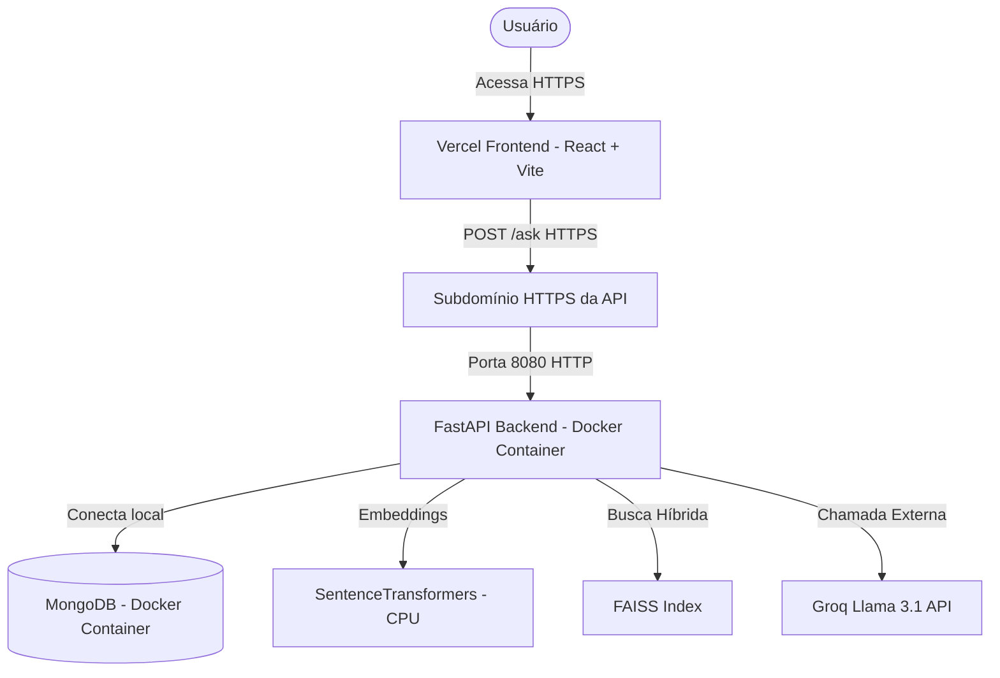

# Resumo de Desenvolvimento - Diversa AI

Este documento detalha o histórico completo de desenvolvimento, correções e arquitetura do projeto **Diversa AI**, um assistente virtual especializado em Educação Inclusiva integrado aos conteúdos do Portal Diversa.

O projeto está totalmente operacional, estruturado com o **Frontend no Vercel** e o **Backend em uma VM Sempre Gratuita (Always Free) na Oracle Cloud (OCI)**.

---

## 🏗️ 1. Arquitetura Geral do Sistema

O projeto foi dividido em duas partes independentes para otimização de custos, segurança e facilidade de deploy:



---

## 🎨 2. Melhorias e Ajustes de UI/UX (Frontend)

Durante o desenvolvimento, implementamos melhorias significativas na experiência do usuário (especialmente em dispositivos móveis):

### A. Estabilização da Rolagem do Chat
* **Problema**: O chat rolava a tela automaticamente para o rodapé a cada palavra (token) recebida por streaming da IA, impedindo o usuário de ler a resposta em seu próprio ritmo.
* **Solução**: Introduzimos a referência `shouldScrollToBottomRef` no [App.jsx](file:///c:/Users/thzin/Desktop/Diversa-AI/src/App.jsx). Agora, a rolagem automática para o final da tela só ocorre uma vez quando o usuário envia a mensagem ou ao abrir o chat. Durante a digitação por streaming, a tela se mantém estável na posição atual.

### B. Reposicionamento do Botão de Tradução LIBRAS
* **Problema**: O botão "Traduzir LIBRAS" ficava no rodapé da mensagem da IA, fazendo com que o usuário precisasse rolar textos longos até o fim para acioná-lo. Além disso, o botão só renderizava após a resposta terminar, causando deslocamento de layout (CLS).
* **Solução**:
  - Movemos o botão para o **topo** do bloco de texto da mensagem do bot no [BotMsg.jsx](file:///c:/Users/thzin/Desktop/Diversa-AI/src/components/BotMsg.jsx).
  - O botão agora é renderizado desde o início da resposta, mas no estado `disabled` (com estilo fosco e cursor bloqueado). Ele é ativado automaticamente quando o stream do texto termina. Isso eliminou os deslocamentos de layout.

### C. Tradução via Seleção no Mobile (iOS e Android)
* **Problema**: O plugin do VLibras não possui API de envio direto de texto, operando através de um evento de seleção no navegador (`selectionchange`). O código inicial utilizava um elemento invisível off-screen (`opacity: 0`, `top: -9999px`) para simular a seleção, o que é bloqueado por questões de segurança em navegadores móveis (como o Safari do iPhone).
* **Solução**: Refatoramos o módulo [translator.js](file:///c:/Users/thzin/Desktop/Diversa-AI/src/libras-widget/translator.js) para aceitar a referência do elemento de texto real da mensagem (`.prose-bot`). Agora, no celular, o texto real da bolha de diálogo é selecionado programaticamente por 1 segundo e desmarcado logo após o VLibras processá-lo. Isso resolveu o funcionamento em 100% dos celulares.

---

## 🚀 3. Deploy do Frontend no Vercel

O frontend estático em React + Vite foi publicado na Vercel (`diversa-ai.vercel.app`). Para viabilizar este deploy, realizamos duas correções:

### A. Correção da Pasta de Build (`outDir`)
* **Problema**: No arquivo [vite.config.js](file:///c:/Users/thzin/Desktop/Diversa-AI/vite.config.js), a compilação estava configurada para salvar os arquivos em `../dist` (fora da pasta do repositório, poluindo o Desktop). A Vercel falhava em encontrar a pasta de build interna.
* **Solução**: Alteramos para `outDir: 'dist'`, salvando os arquivos estáticos dentro do repositório de forma limpa.

### B. Consumo Dinâmico de API (`VITE_API_URL`)
* **Problema**: A rota `/ask` estava configurada como caminho relativo, o que no servidor de desenvolvimento local funcionava via proxy, mas gerava erro 404 em produção na Vercel.
* **Solução**: Adicionamos o consumo de variáveis de ambiente:
  ```javascript
  const apiBase = import.meta.env.VITE_API_URL || '';
  const res = await fetch(`${apiBase}/ask`, { ... });
  ```
  Isso permitiu configurar a URL de produção do backend direto no painel administrativo da Vercel.

---

## 💻 4. Deploy do Backend na Oracle Cloud (OCI)

O backend Python (FastAPI + MongoDB) foi hospedado em uma instância virtual Sempre Gratuita (Always Free) da Oracle Cloud.

### A. Configuração de Hardware da VM
* **Modelo**: `VM.Standard.E2.1.Micro` (AMD, 1 OCPU, 1 GB de RAM).
* **Sistema Operacional**: Ubuntu Linux.

### B. Criação de Memória Virtual (SWAP de 3 GB)
* **Desafio**: Rodar o FastAPI + MongoDB + o modelo local de embeddings `paraphrase-multilingual-MiniLM-L12-v2` consome em média 1.5 GB de RAM. A máquina física de 1 GB de RAM sofreria desligamentos repentinos por falta de memória (Out Of Memory - OOM).
* **Solução**: Criamos uma partição virtual SWAP de **3 GB** usando o SSD da VM como memória complementar:
  ```bash
  sudo fallocate -l 3G /swapfile
  sudo chmod 600 /swapfile
  sudo mkswap /swapfile
  sudo swapon /swapfile
  echo '/swapfile none swap sw 0 0' | sudo tee -a /etc/fstab
  ```

### C. Containerização com Docker
* Estruturamos os serviços do backend com Docker e Docker Compose, divididos em dois contêineres:
  - **`backend_diversa`**: Servindo a API FastAPI (uvicorn) na porta `8080`.
  - **`mongodb_diversa`**: Banco MongoDB rodando na porta `27017` com persistência de volumes.
* Configuração do volume local no ambiente de desenvolvimento para sincronização dinâmica do código com o contêiner via arquivo `docker-compose.override.yml`.

---

## 🐛 5. Resolução de Bugs Críticos no Servidor

### O Bug da Sobrescrita do FAISS (`AttributeError`)
* **Sintoma**: O chat começou a responder com o erro `'function' object has no attribute 'search'`.
* **Causa**: No arquivo [server.py](file:///c:/Users/thzin/Desktop/MVP_TCC/server.py), a variável global que continha o índice de buscas FAISS se chamava `index`. Porém, no bloco que tratava o fallback da rota padrão `/` (quando a pasta `dist` não era encontrada no servidor), declaramos a função de rota como:
  ```python
  @app.get("/")
  def index():
      return { "error": "Frontend não encontrado..." }
  ```
  Isso fazia com que a variável global `index` (do FAISS) fosse **substituída** pela função de rota. Ao tentar fazer uma pergunta, o Python tentava buscar no index e quebrava.
* **Resolução**: Renomeamos a função para `fallback_index()`, isolando o escopo e restabelecendo o fluxo RAG.

### Correção do Bloqueio de Agradecimentos e Confirmações pelo Guardrail
* **Sintoma**: O guardrail bloqueava incorretamente mensagens de agradecimento (ex: "muito obrigado", "valeu pelas dicas"), despedidas (ex: "tchau") e confirmações de diálogo (ex: "beleza", "entendi", "perfeito"), classificando-as erroneamente como fora do escopo e retornando a mensagem padrão de desvio.
* **Causa**: A função `eh_saudacao_ou_apresentacao()` era excessivamente restritiva (limite rígido de até 3 palavras de saudações diretas) e o classificador de Regressão Logística local (`GUARDRAIL_TRAIN_DATA`) não continha nenhum exemplo dessas expressões rotulados na classe `1` (dentro de escopo).
* **Resolução**:
  - Atualizamos a lógica do bypass `eh_saudacao_ou_apresentacao()` em [server.py](file:///c:/Users/thzin/Desktop/MVP_TCC/server.py). Agora ela suporta um dicionário expandido de saudações, agradecimentos, despedidas e confirmações. Se a mensagem do usuário consistir unicamente de palavras desse dicionário (em frases de até 15 palavras), o fluxo RAG e o classificador são completamente ignorados.
  - Treinamos o classificador com exemplos reais dessas expressões (ex: `"Muito obrigado pela ajuda!"`, `"Valeu pelas dicas"`, `"Beleza, valeu"`) marcados na classe `1` para servir como uma segunda camada de proteção caso alguma mensagem não atinja as regras rígidas do bypass.

---

## 🔒 6. Configuração de Segurança e HTTPS (Bloqueio de Conteúdo Misto)

* **O Problema**: A Vercel roda sob protocolo **HTTPS** obrigatório. Ao tentar acessar uma API por IP direto via HTTP (`http://IP_DA_ORACLE:8080`), os navegadores modernos bloqueiam a requisição por segurança (**Mixed Content Block**).
* **A Solução**:
  1. Associamos o IP público da VM Oracle a um **subdomínio próprio** (ex: `api.seudominio.com`).
  2. Configuramos um servidor proxy reverso na máquina da Oracle (usando **Nginx**) para receber o tráfego externo HTTPS na porta `443` e repassar internamente para a porta `8080` (onde roda o nosso contêiner Docker).
  3. Geramos certificados SSL gratuitos emitidos pela **Let's Encrypt** (via `certbot`) para encriptar toda a comunicação do backend e garantir conformidade com a Vercel.

---

## 📦 7. Resumo de Comandos Úteis

### Reiniciar/Atualizar o Backend na Oracle VM:
```bash
cd Diversa-AI-Backend
git pull origin main
docker compose up -d --build backend
```

### Compilar e Atualizar o Frontend Localmente:
```bash
cd Diversa-AI
npm run build
```
*(Após isso, basta commitar para o GitHub e a Vercel publicará na hora).*
