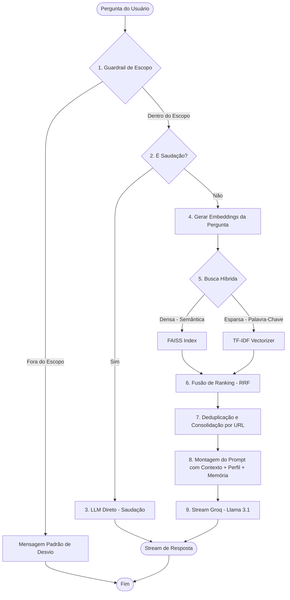

# Guia de Arquitetura RAG - Diversa AI

Este documento detalha o funcionamento e a arquitetura do pipeline **RAG (Retrieval-Augmented Generation)** implementado nos arquivos `popula_db.py` e `server.py` do projeto **Diversa AI**.

O sistema utiliza técnicas modernas de recuperação de informações híbrida, classificação local de segurança (guardrail), personalização de perfis e gerenciamento inteligente de contexto.

---

## 🗺️ Visão Geral do Pipeline RAG

O fluxo de processamento de uma pergunta do usuário até a resposta final da IA segue as etapas abaixo:

---

## 🛠️ 1. Módulo de População e Indexação (`popula_db.py`)

Este script é responsável pela ingestão de dados e criação do banco vetorial. Ele prepara a base de dados em 4 etapas:

1. **Leitura e Parsing**: Lê o arquivo `artigos.json` contendo a extração dos artigos do portal Diversa.
2. **Text Chunking (Divisão em Trechos)**: Divide o texto longo dos artigos em pequenos blocos (chunks) lógicos. Chunks menores garantem que a busca traga apenas o trecho exato da resposta e evitam ultrapassar o limite de tokens da LLM.
3. **Vetorização Local (Embeddings)**: Utiliza a biblioteca `sentence-transformers` com o modelo **`paraphrase-multilingual-MiniLM-L12-v2`** rodando localmente na CPU. Cada trecho de texto é convertido em um vetor denso de **384 dimensões** que representa o significado semântico do texto.
4. **Armazenamento**:
   - Salva os trechos de texto, metadados (título, URL) e um identificador (`faiss_id`) no banco **MongoDB** (coleção `artigos_chunks`).
   - Adiciona os vetores gerados no índice **FAISS** (`IndexFlatIP` - Produto Interno, que calcula a similaridade de cosseno com vetores normalizados) e salva o índice em disco no arquivo `diversa.index`.

---

## 🛡️ 2. O Guardrail de Escopo Local

Para evitar que a IA gaste tokens respondendo a perguntas fora do tema da Educação Inclusiva (ex: receitas de bolo, códigos de programação, futebol), implementamos um **Guardrail Semântico Local** no servidor:

* **Treinamento Dinâmico**: Durante a inicialização do `server.py`, o sistema treina um classificador de **Regressão Logística** (`scikit-learn`) usando os embeddings do modelo local sobre um conjunto pré-definido de exemplos rotulados (`GUARDRAIL_TRAIN_DATA`), divididos em tópicos válidos (classe `1`) e inválidos (classe `0`). Recentemente, adicionamos também exemplos de agradecimentos, confirmações e saudações comuns como classe `1` no conjunto de dados para evitar que o classificador bloqueie interações cotidianas.
* **Inferência**: A pergunta do usuário é vetorizada e enviada ao classificador. Se a confiança de que a pergunta está fora do escopo for **maior que 65%**, o RAG é interrompido imediatamente e a API retorna uma mensagem amigável padrão, economizando custos com a API do Groq.
* **Bypass de Interatividade (Saudações/Agradecimentos/Confirmações)**: A função `eh_saudacao_ou_apresentacao` valida a mensagem antes do classificador. Ela permite correspondência exata para saudações, agradecimentos (ex: "obrigado", "valeu", "grato") e confirmações comuns (ex: "beleza", "entendi", "ok"). Além disso, mensagens de até 15 palavras que contenham apenas termos de um dicionário curado de palavras de interação (`palavras_chave`) pulam automaticamente a busca RAG e o classificador de escopo, sendo tratadas diretamente como interações normais do usuário pela LLM.

---

## 🔍 3. Busca Híbrida Habilitada por RRF (Reciprocal Rank Fusion)

Em vez de depender apenas de busca semântica (que às vezes falha ao buscar termos técnicos exatos ou siglas) ou apenas de busca por palavra-chave (que não entende sinônimos), implementamos a **Busca Híbrida**:

### A. Busca Densa (FAISS)
* Vetoriza a pergunta e realiza uma busca de similaridade de cosseno no índice FAISS.
* Retorna trechos que possuem **afinidade conceitual** com a dúvida do usuário, mesmo que usem palavras diferentes.

### B. Busca Esparsa (TF-IDF)
* Utiliza um vetorizador TF-IDF (`TfidfVectorizer` do `scikit-learn`) treinado com todo o corpus dos chunks do MongoDB.
* Encontra trechos que contêm **palavras-chave idênticas ou muito próximas** (como siglas "AEE", "LBI", "BNCC").

### C. Fusão com RRF (Reciprocal Rank Fusion)
* Os rankings das duas buscas (densa e esparsa) são mesclados utilizando o algoritmo RRF.
* O score RRF de cada documento é calculado pela fórmula:
  $$Score_{RRF} = \sum_{m \in M} \frac{1}{k + Rank_m(d)}$$
  *(onde $k$ é uma constante de suavização, configurada como `60`, e $Rank_m(d)$ é a posição do documento no ranking da busca $m$).*
* Chunks que aparecem no topo de ambos os algoritmos ganham prioridade absoluta, garantindo um resultado de busca muito mais preciso.

---

## 🔗 4. Consolidação e Deduplicação de Fontes

Muitas vezes, a busca retorna múltiplos trechos (chunks) que pertencem ao mesmo artigo/página. Enviar todos esses trechos separados para a LLM causa redundância e desperdiça tokens.
* **Consolidação**: O sistema agrupa os trechos retornados pela URL.
* **Mesclagem**: Se houver mais de um trecho da mesma URL, o texto é unificado em um único bloco de contexto separado por `[...]`.
* **Fontes**: O frontend recebe um JSON limpo com a lista das fontes consultadas (`sources`), contendo títulos e links que o usuário pode clicar para auditar a resposta da IA.

---

## 🎭 5. Perfis de Resposta Dinâmicos (User Profiles)

Para adaptar a linguagem ao público-alvo do Portal Diversa, o prompt do sistema e os parâmetros da LLM são alterados dinamicamente com base no perfil escolhido pelo usuário:

| Perfil | Temperatura | Penalidade de Frequência | Comportamento da Resposta |
| :--- | :---: | :---: | :--- |
| **Família** | `0.5` | `0.2` | Linguagem simples, acolhedora e empática. Evita jargões técnicos. Foca em dicas práticas e direitos de forma clara. |
| **Professor** | `0.4` | `0.3` | Resposta didática, focada em planos de aula, adaptação de atividades escolares e metodologias práticas de ensino. |
| **Gestor** | `0.1` | `0.0` | Resposta extremamente técnica, objetiva e direta. Foca em leis (LBI, LDB), estruturação de salas de recursos e conformidade administrativa. |

---

## 🧠 6. Gerenciamento de Histórico e Memória Conversacional

Para que o chatbot se lembre do contexto da conversa atual sem estourar o limite de tokens das chamadas subsequentes, o `server.py` implementa duas mecânicas:

1. **Persistência em Banco**: Toda conversa é associada a um `session_id` único gerado no frontend. O histórico de mensagens é gravado no MongoDB (coleção `conversas`).
2. **Janela Deslizante (Sliding Window)**: Apenas as **últimas 8 mensagens (4 turnos de pergunta/resposta)** daquela sessão são resgatadas do banco e enviadas no payload da nova requisição à API do Groq. Isso garante que a IA se lembre do assunto recente da conversa, mantendo a chamada leve e econômica.

---

## ⚡ 7. Streaming de Respostas (FastAPI Server-Sent Events - SSE)

Para garantir uma interface altamente responsiva (onde o usuário não precisa esperar a resposta inteira ser gerada para começar a ler), a rota `/ask` utiliza **Streaming HTTP**:
* O endpoint retorna uma resposta no padrão `text/event-stream` (`StreamingResponse` do FastAPI).
* A função geradora `stream_groq` consome a API do Groq em modo stream (`stream=True`) e envia os blocos de texto (tokens) ao frontend no formato de eventos SSE (`event: token`, `data: {"text": "palavra"}`).
* Eventos especiais como `event: sources` (fontes de pesquisa) e `event: done` (término do processamento) são enviados de forma assíncrona para que o frontend configure os elementos visuais na hora certa.
